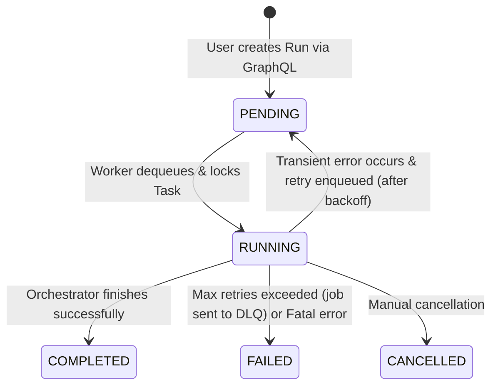

# Data Model: Distributed Execution and Reliability

This document outlines the data schemas and structures used in the distributed execution and fault tolerance design. These schemas cover the Redis-backed queue payloads, locking mechanisms, and database interactions.

---

## 1. Redis Task Queue Schema (Redis List: `agent_tasks`)

Each element in the `agent_tasks` queue is a JSON-serialized object representing a run to be processed.

### Schema (JSON)
```json
{
  "run_id": "string (UUID)",
  "retry_count": "integer",
  "max_retries": "integer",
  "enqueue_time": "string (ISO 8601 timestamp)",
  "error_history": [
    {
      "attempt": "integer",
      "timestamp": "string (ISO 8601 timestamp)",
      "error": "string"
    }
  ]
}
```

### Fields
- `run_id`: References the corresponding `AgentRun.id` in PostgreSQL.
- `retry_count`: Number of times this task has been retried (starts at `0`).
- `max_retries`: Configurable retry limit for this task.
- `enqueue_time`: Timestamp when the task was put into the queue (used for measuring Queue Wait Time).
- `error_history`: Array containing details of previous failures for debugging.

---

## 2. Redis Distributed Lock (`lock:run:{run_id}`)

To guarantee that only one worker processes a task run at a time, workers must acquire a distributed lock.

### Command Definition
- **Key**: `lock:run:{run_id}`
- **Value**: `worker_id` (a unique string identifier generated by the worker process, e.g., `worker-uuid`)
- **Parameters**: `NX` (Set if not exists), `PX` (Expiration time in milliseconds)
- **TTL**: 10 minutes (`600000` ms) to prevent deadlocks in case of unexpected worker crash.

---

## 3. Dead Letter Queue (DLQ) Schema (Redis List: `agent_tasks:dlq`)

Failed jobs that exceed their `max_retries` are moved to the DLQ.

### Schema (JSON)
```json
{
  "task": {
    "run_id": "string (UUID)",
    "retry_count": "integer",
    "max_retries": "integer",
    "enqueue_time": "string (ISO 8601 timestamp)"
  },
  "failed_at": "string (ISO 8601 timestamp)",
  "reason": "string (error summary)",
  "error_details": "string (stack trace or full logs if available)"
}
```

---

## 4. Run State Transitions

State transitions are reflected in PostgreSQL (`AgentRun.status`):


- **PENDING**: Run is created and placed on the queue.
- **RUNNING**: A worker is currently executing the run graph.
- **COMPLETED**: The run completed successfully.
- **FAILED**: The run failed due to non-retryable errors or retry exhaustion.
